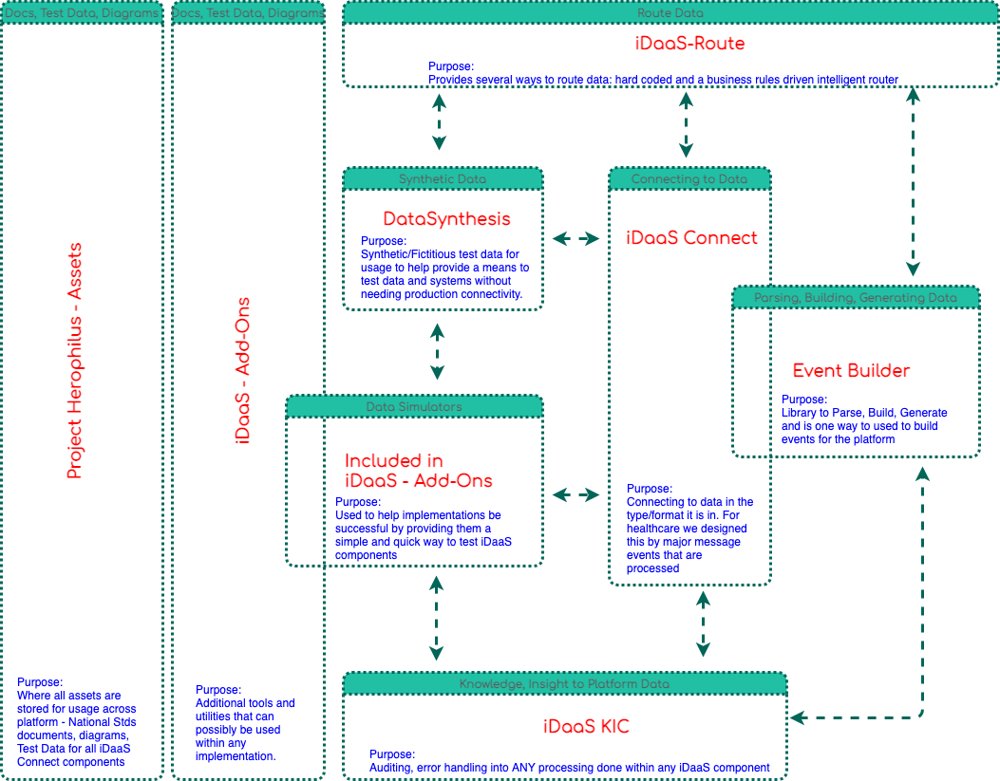
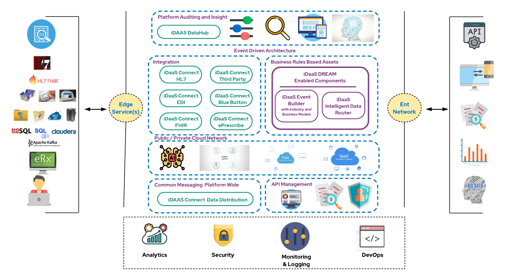
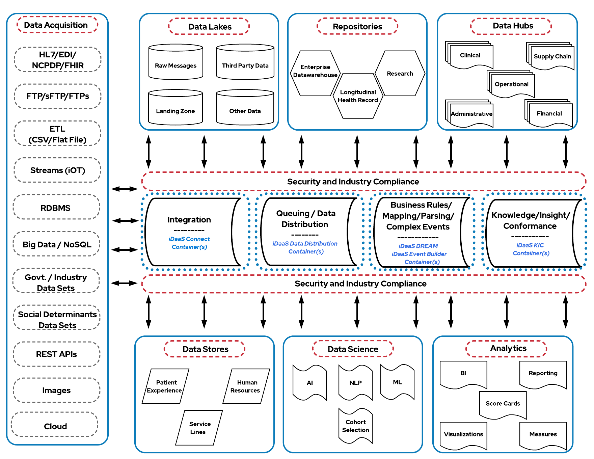

[comment]: <> (![iDaaS Word Art]&#40;images/iDAAS-Web-WordCloud.png&#41;)
# General Content Links
Below are general content links to help ensure we share key content from the project or industry with everyone.

| General Content|
| -------------|
| <a href="https://github.com/Project-Herophilus/Project-Herophilus/blob/main/NationalStds/FederalStandards/CMS-Interoperability%20and%20Data%20Access%20Final%20Rule.pdf" target="_blank">CMS Interoperability Final Rule</a>|
| <a href="https://github.com/Project-Herophilus/Project-Herophilus/blob/main/NationalStds/FederalStandards/ONC_Cures_Act_Final_Rule_03092020.pdf" target="_blank">21st Centrury Cures Act</a>|
| <a href="https://github.com/Project-Herophilus/Project-Herophilus/blob/main/NationalStds/FederalStandards/USCDI-Version-2-July-2021-Final.pdf" target="_blank">US CDI v2 Standard</a>|

# Common Links
Below are common links to help you navigate all the site content.

| General|Platform Design |
| -------------|----------|
|[General Background](./docs/General/Background.md)|[Architecture](docs/Design/Architecture.md)|
|[OpenSource](docs/General/OpenSource.md)|[Design Principles](docs/Design/DesignPrinciples.md)|
|[Code of Conduct](docs/General/CodeOfConduct.md)|[Capabilities](docs/Design/Capabilities.md)|
|[Fictious Org.](docs/General/FictitiousOrg.md)|[Platform Components](docs/Design/PlatformComponents.md)|
|[Technical Leadership](docs/General/TechnicalLeadership.md)|[Integration Standards Support](docs/Design/IntegrationStandardsSupported.md)|

More specific links around technologies used, setup and implementations:

| Technical |Use Cases - Implementations |
| -------------|----------|
|[Technologies Leveraged](docs/Technical/Technologies.md)|[Platform Component Specifics](docs/UseCases/PlatformComponents-Specific.md)|
|[Technical Guides](docs/Technical/intro.md)|[Implementation Guides](docs/ImplementationGuides/intro.md)|

# Background
Healthcare IT is an industry that is starting to modernize. While others like to make jokes and comments the sad 
fact is that a majority of the systems that healthcare uses are purchased from vendors and are based on technologies from the 1970's to late 1990's.
These systems hold access to billions of patient, financial, life sciences and adminstrative data used across all of healthcare.
We are now starting to see vendors modernize their systems and also healthcare more willing than ever to invest or develop new
capabilities as needed to meet the new demands. The reason for this change is that there are many forces impacting healthcare from a competitive, legislative or reimbursement perspective. Over the last decade these 
forces have continued to both grow and morph, sometimes in exponential ways. 

Some of the forces imoacting healthcare are:
- External forces include state, jurisdicitional and federal mandates continuing to expand.
- Competitors that are also partners.
- Public Cloud
- Third party businesses leveraging various aspects of both clinical and financial data, financial 
pressures from areas such as reimbursement levels dropping while requirements around care and information continue 
to increase.
- Technical demonstration of value to business stakeholders.

With all these forces the one thing healthcare sees consistently is  their main means to address all these forces is 
found with their data. Because of the extensive amount of data involved within the healthcare organizations they 
continue to procure, or are transforming, to develop and deliver solutions. Irrespective of healthcare organizations 
business model(s): buy, build or a combination of buy and build the key remains that healthcare’s effectiveness is 
driven by data driven capabilities from more accurate access to information in near real-time that can give them 
intelligence and enable them to have better platforms and capabilities in near real time.

The intent of this community is to help healthcare build and enable solutions and platforms. Our focus, in 
developing this design pattern/reference architecture has been, and will continue to be, helping to meet data 
where it is and transform application and data integration to become data innovation. 
Our belief is that by enabling teams to work together across organizational departments and in a consistent 
and extensible manner we will help transform healthcare’s ability to deliver more vibrant applications 
and platforms. While we are working on helping many healthcare companies transform with this design 
pattern/accelerator we are also showcasing the benefits and value of enterprise open source solutions.

Please feel free to go to our discussion
and/or issues areas in any of the specific repositories. We consider all feedback as we are looking to improve our design pattern/reference architecture.
Any communication to these areas or the project owners influences our [Technical Roadmap](docs/Roadmap/index.md).

# Intelligent DaaS (Data as a Service)
Welcome, Intelligent DaaS (Data as a Service) is a newer form of innovation. It is intended to be a <b> design pattern/reference architecture/accelerator </b> 
built atop industry-leading open-source software. The platform is constructed in a very modern cloud native manner ensuring that any component is designed and built for a specific purpose with scale and extensibility.

The sole purpose of ALL the capabilities we have built for healthcare is to enable <b> Data as an Asset</b>. 
Data Integration is all about Data Innovation and all the things you can achieve with access to the data:

Here is another way to think about data innovation with intelligent Daas.

With all this being said, <b>it was important for our code to be completely open and available with Apache 2 License!!</b>
We are sure you have questions, concerns, or doubts; such as:

* Q: I already have an integration engine or enterprise application integration platform? 
  A: You should not replace an existing integration engine or EAI platform, that would take time with lots of coordination. We would argue it is working for the 
  masses then you should keep it in place. Do you view that platform as strategic or innovative though? Probably not, but 
  it can provide access to existing information for business efforts though. Why not use it for what is good at and build 
  innovation atop it. You can also enable innovation at an enterprise, organization or team level with this model without 
  sacrificing security.
* Q: I have heard all of this before and I am still not seeing any industry progress? A: The industry is evolving and changing. 
  Digital in healthcare, along with several other factors, is causing the entire way healthcare data to not only be 
  re-imagined but re-evaluated. This is forcing various changes including
  new and more modern integration standards.
* Q: Why would you do this? A: Its time to help lead and drive the change that will benefit everyone in healthcare, especially the patients.
* Q: Has anyone run the risk and put their code and all their work out there for the masses to leverage in this manner? A: Not until now, open-source is core to our culture amd is all about the community and open-source mindset. Because of this we decided to follow those practices for everything for this effort. We also have and will continue to publish onto GitHub through our organization.

# Partnering to Delivery Industry Enablement
Partnering is at the core of our capabilities we are enabling for the healthcare industries.

[Driving Innovation](docs/Technical/Implementation.md)

 
Happy coding!!!!
